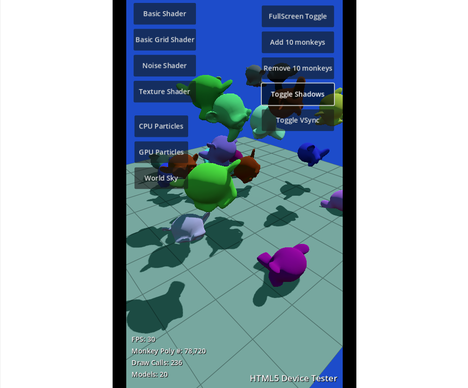

# Godot Device Performance Test

test it out on itch.io: https://scottpetrovic.itch.io/godot-device-performance-test

I was testing out the HTML5 export in Godot 4.4 and was seeing differences between my local preview, HTML5 export on computer, and HTML5 export on mobile phone. Because of the hardware differences between them, I thought of creating this litle tool to help see how a device can handle.

It is mostly a bunch of buttons to turn on and off features. You can look at draw calls, frames per second to see how each feature affects things. There might even be things that don't work/appear based off the device you are using.

## Exporting and preview

I am just using the normal HTML5 export. For testing, I find using something like Netlify easy. Netlify is a free service you test things by dropping your files into. I drop all my HTML5 files into a project and netlify gives me a link. I give that link to my phone with something like an email or message. Then just click the link on your phone to open it.